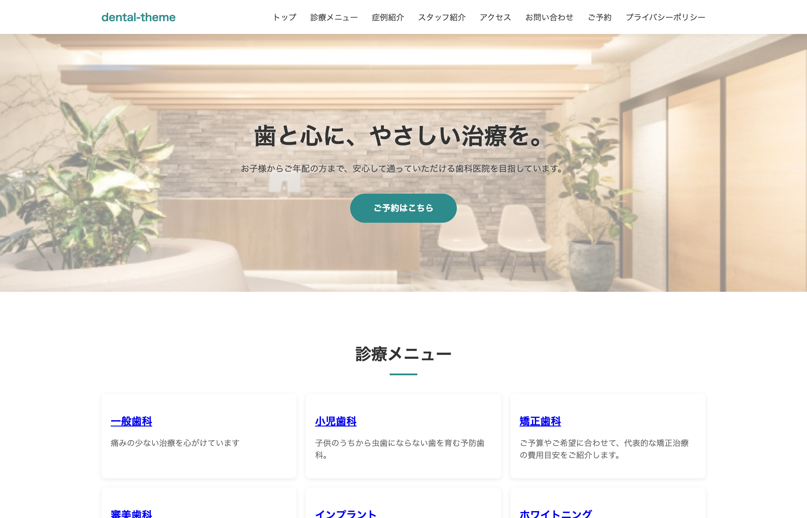
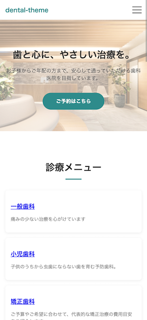

# 歯科医院コーポレートサイト

WordPressオリジナルテーマ制作によるポートフォリオ作品です。

## 🔗 公開URL

[https://coda-webcraft.github.io/dental-theme/](https://coda-webcraft.github.io/dental-theme/)

| PC | スマホ |
|---|---|
|  |  |

## 制作概要

歯科医院を想定したコーポレートサイトを、既存テーマや固定のページビルダーに頼らず、WordPressのオリジナルテーマとして設計・制作しました。カスタム投稿タイプとカスタムフィールドを軸に、実際の医院運営で更新が発生しやすい「診療メニュー」「症例紹介」「スタッフ紹介」を、専門知識がない担当者でも管理画面から更新できる形に設計しています。

機能実装だけでなく、ナビゲーション設計・アクセシビリティ・セキュリティ・法的配慮・バージョン管理まで一貫して対応し、公開可能な水準の完成度を目指しました。

## 使用技術

| 項目 | 使用技術 |
|---|---|
| CMS | WordPress（オリジナルテーマ） |
| カスタムフィールド | Advanced Custom Fields（ACF） |
| CSS設計 | Sass（SCSS）／ FLOCSS ／ BEM |
| JavaScript | Vanilla JS（ハンバーガーメニュー／スクロール連動UI） |
| レスポンシブ | モバイルファースト設計 |
| バージョン管理 | Git / GitHub |

## サイト構成

| ページ | 概要 |
|---|---|
| TOPページ | 背景写真付きヒーロー／診療メニュー／症例紹介／スタッフ紹介／お知らせ／アクセスの6セクション構成 |
| 診療メニュー | 一覧・詳細ページ（カスタム投稿タイプ、アイキャッチ画像対応） |
| 症例紹介 | カテゴリ・年代・性別によるタグ表示、カテゴリ別絞り込みページ、Before/After画像比較 |
| スタッフ紹介 | 一覧・詳細ページ、役職・プロフィール表示 |
| アクセス | 院情報・診療時間・地図埋め込み |
| お問い合わせ | 入力→確認→送信→完了の4ステップ、サーバーサイドバリデーション、スパム対策 |
| ご予約 | 入力→確認→送信→完了の4ステップ、診療メニュー・希望日時（1時間単位の時間選択）の選択、サーバーサイドバリデーション、スパム対策 |
| お知らせ | 標準投稿機能を活用した一覧・詳細ページ |
| 404ページ | 存在しないURLへのアクセス時に表示する専用ページ |
| プライバシーポリシー | 個人情報取り扱いに関する案内ページ |

## 実装のポイント

### カスタム投稿タイプ・ACF設計

- 「診療メニュー」「症例紹介」「スタッフ紹介」をカスタム投稿タイプとして設計
- 投稿タイプごとに必要な情報をACFで細かく設計（キャッチコピー・料金表・治療の流れ・Before/After画像・年代/性別・役職 など）
- 「診療カテゴリ」タクソノミーを診療メニューと症例紹介で共有し、横断的な絞り込みを実現
- フロントページを固定ページに紐付け、ヒーロー背景画像をACFで管理画面から差し替え可能に

### カスタムクエリによる動的表示

- WP_Queryを用いて、TOPページに各コンテンツの最新情報を横断的に表示
- タクソノミーによる症例の絞り込み表示（カテゴリ別アーカイブページ）
- 投稿オブジェクトフィールドを用いた、診療メニューと症例紹介の相互リンク

### お問い合わせフォーム

- プラグインに依存せず、入力→確認→送信→完了の4ステップをPHPで独自実装
- サーバーサイドバリデーション（必須項目チェック、メールアドレス形式チェック、電話番号形式チェック）
- honeypot方式によるスパム対策を実装し、bot経由の不正送信を防止

### 予約フォーム

- お問い合わせフォームと同じ設計思想で、入力→確認→送信→完了の4ステップをPHPで独自実装
- 診療メニュー（カスタム投稿タイプ）をWP_Queryで取得し、プルダウンの選択肢として動的に出力
- 予約希望時間を1時間単位のプルダウン選択式にし、自由入力による表記ゆれを防止
- サーバーサイドバリデーション、honeypot方式によるスパム対策をお問い合わせフォームと共通の設計で実装
- フォーム項目のname属性がWordPressの公開クエリ変数（カスタム投稿タイプのクエリ変数など）と衝突しないよう命名を設計し、意図しないリダイレクトを防止

### CSS設計・レスポンシブ対応

- Sassを用いたFLOCSS設計により、パーツ単位で再利用しやすいスタイル管理を実現
- BEM記法によるクラス設計で、命名の衝突や崩れを防止
- `box-sizing: border-box` の全体適用など、レイアウト崩れを防ぐ基礎設計を徹底
- モバイルファーストでレスポンシブに対応し、スマートフォン表示では独自実装のハンバーガーメニューに切り替え

### ナビゲーション・UI

- ヘッダー・フッターに `wp_nav_menu` を用いたメニュー機能を実装（スマートフォンはハンバーガーメニュー）
- スクロール連動で表示が切り替わる「ページトップへ戻る」ボタンをJavaScriptで実装

### アクセシビリティ・セキュリティ・法的配慮

- サイトアイコン（ファビコン）の設定、画像への代替テキスト（altテキスト）の付与
- 404ページの独自実装により、存在しないURLへのアクセスにも適切に対応
- 個人情報を取得するフォームを備えるサイトとして、プライバシーポリシーページを整備

### バージョン管理

- Gitによるローカルでのバージョン管理を導入し、変更履歴を記録
- GitHubにリポジトリを公開し、コード全体を確認できる状態を整備

## こだわった点・工夫した点

**実務目線での機能提案**：症例紹介の参考サイトを分析し、カテゴリ・年代・性別によるタグ表示や絞り込み機能を、指示がない状態から自主的に設計・提案しました。

**医療サイトへの配慮**：自由診療に関する注記表示をACFの条件分岐で出し分けるなど、医療広告ガイドラインを意識した実装を行いました。

**堅実なデバッグ姿勢**：制作過程で発生した不具合（テンプレートの読み込み順、キャッシュ、フィールド未登録、Sassの名前空間エラー、フォーム項目名とURLクエリ変数の衝突など）は、ログ確認や要素検証を通じて原因を切り分け、場当たり的な対処ではなく根本解決する開発フローを徹底しました。

**公開を見据えた仕上げ**：機能実装後もアクセシビリティ・セキュリティ・法的配慮・バージョン管理まで手を止めず、実際に公開できる水準までサイトを仕上げました。

## 今後の展望

- コンテンツ（診療内容・症例写真・スタッフ情報）の追加による情報量の充実
- SEOを意識した構造化データ・メタ情報の実装
- 表示速度・パフォーマンスの計測と最適化

---

制作者：coda.　／　制作環境：Local（ローカル開発環境）
